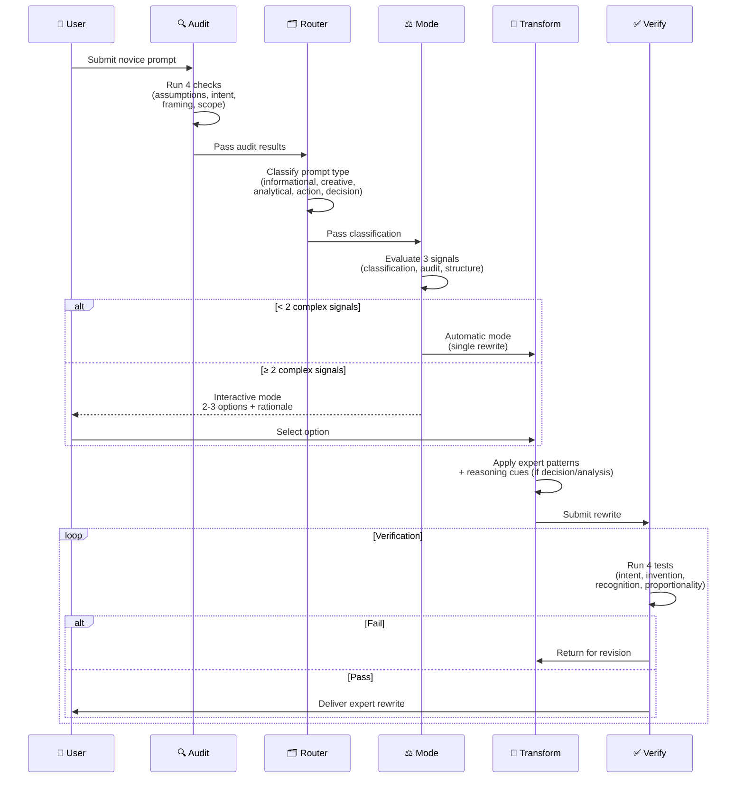

# prompt-forge

[](https://skills.sh/hyuce/prompt-forge)

Transform novice prompts into expert-framed requests with logical rigor.

## What This Is

An AI agent skill that bridges the gap between how non-specialists phrase requests and how domain experts would frame the same request. Unlike simple prompt rewriters, prompt-forge adds:

- **Pre-transformation audit** — catches flawed assumptions, loaded questions, and false dichotomies *before* rewriting
- **Prompt classification router** — applies the right expert patterns based on prompt type (informational, creative, analytical, action, decision)
- **Hybrid mode selection** — automatically chooses between single-rewrite (simple prompts) and interactive (complex prompts with ambiguity)
- **Post-transformation verification** — validates intent preservation, no invention, recognition, and proportionality
- **Reasoning integration** — embeds structured reasoning cues into decision/analysis prompts

## Pipeline



## How It Differs from prompt-enhancer

| Feature | prompt-enhancer | prompt-forge |
|---------|----------------|--------------|
| Mode | Always automatic | Hybrid (auto + interactive) |
| Logical audit | None | Pre-transformation checklist |
| Fallacy detection | None | 6 common prompt fallacies |
| Classification | None | 5-type router |
| Verification | None | 4-test post-check |
| Reasoning cues | None | Conditional (decision prompts) |
| Token footprint | ~169 lines | ~196 lines (more features, less text) |

## Installation

```bash
npx skills add hyuce/prompt-forge
```

This installs the skill to your agent's skills directory (Claude Code, Cursor, Gemini CLI, GitHub Copilot, OpenCode, etc.).

**Global install (all projects):**
```bash
npx skills add hyuce/prompt-forge --global
```

**Specific agent:**
```bash
npx skills add hyuce/prompt-forge --agent cursor
```

## Security

This skill contains only five files: `SKILL.md` (the methodology), `examples.md` (transformation examples), `test-results.md` (RED/GREEN/REFACTOR evidence), `README.md` (this file), and `LICENSE` (MIT). All are plain markdown or text. **No executable code, no scripts, no network calls, no obfuscation, no data exfiltration, no prompt-injection patterns.** The `npx skills add` command copies these files to your agent's skills directory; the agent reads them as instructions, nothing more.

Independent audits:

- [Gen Agent Trust Hub](https://skills.sh/hyuce/prompt-forge/prompt-forge/security/agent-trust-hub) — **Pass / Safe**. Verified the skill is a prompt-based methodology with no executable content.
- [Snyk](https://skills.sh/hyuce/prompt-forge/prompt-forge/security/snyk) — **Pass / Low Risk** (last audited Jun 20, 2026). The initial E005 flag (triggered by the bare `npx skills add` install command pattern) was downgraded to no issues detected after the README gained a Security section — Snyk's content analysis found sufficient evidence that the skill contains no executable code.

## Usage

Invoke when:
- User asks to improve, refine, or rewrite a prompt
- User needs help framing a request for an AI system
- A prompt feels vague, overloaded, or logically unsound

## Structure

```
prompt-forge/
├── SKILL.md           # Core skill logic (~196 lines)
├── examples.md        # 12 transformation examples (cross-reference)
├── test-results.md    # RED/GREEN/REFACTOR evidence
├── README.md          # This file
└── LICENSE            # MIT
```

## License

MIT — see [LICENSE](LICENSE).
